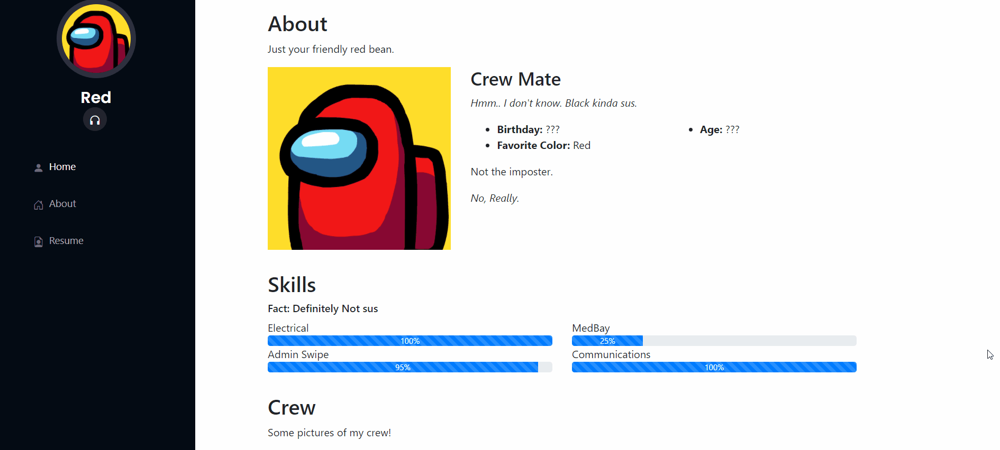
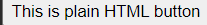
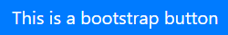
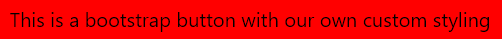
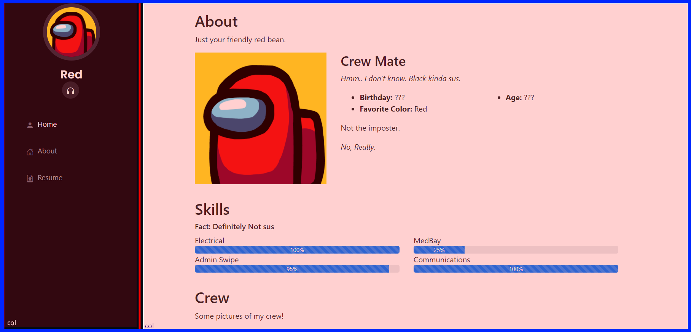
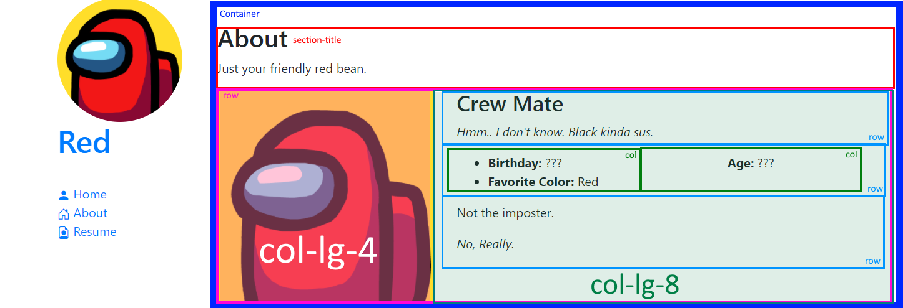

# Personal Website

Let's create a personal website using Frameworks!

It can be for yourself or for your favorite character!

Final Page Example


## Objective

* Have a basic understanding of what frameworks are

## Prerequisites

To complete this project, students should have the following:

* Good understanding of HTML structures and attributes.
* Good understanding of CSS.

## Your Challenge

### Part 1: Introduction

Before we start coding, we first need to understand what frameworks are. You may recall
from [Day 1](https://github.com/ICSpark/intro-to-web-dev/blob/master/01%20-%20Intro%20to%20HTML%2C%20CSS%2C%20JS/01.md):

1. An HTML element is the basic building block of a webpage. [Elements](https://w3schools.com/html/html_elements.asp)
   have the following structure. Elements consist of a **start tag** and **end tag**, with content in between. More
   information about the element can be found in the start tag in the form of **attributes** (e.g. id, class, src,
   href...etc.).

```HTML
<h1 id="title">Hello World!</h1>
<!-- h1 is the element -->
<!-- <h1> is the start tag -->
<!-- </h1> io the end tag -->
<!-- id is the attribute -->
```

2. To add style to our elements, we need to [select](https://www.w3schools.com/css/css_selectors.asp) which elements to
   style, then specify which [properties](https://www.w3schools.com/cssref/default.asp) to change. We can select
   elements by tag name, ids, or classes as follows:

``` html
<h1>Title1</h1>
<h1>Title2</h1>

<p id="p1">Paragraph 1</p>

<p>Paragraph 2</p>

<div class="profile">
  <h2>Bob</h2>
  <p>I like pizza.</p>
</div>

<div class="profile">
  <h2>Sally</h2>
  <p>I am 21 years old.</p>
</div>
```

``` css
/* Select all h1 elements and change the text color to red. */
h1 {
  color: red;
}
/* Select the element with id of p1 and change the background color to blue and position it 100px from the left and 150 px from the top of the window. */
#p1 {
  background-color: blue;
  position: fixed;
  left: 100px;
  top: 150px;
}
/* Select all elements with class of profile and change the width, height, and color. */
.profile {
  width: 300px;
  height: 500px;
  color: yellow;
}
/* Select all h2 elements within the class of profile and change the text color to red. */
.profile h2 {
  color: red;
}
```

So far all of our assignments require us to style the elements ourselves. We would always link up our own ``styles.css``
to our ``index.html`` file:

```HTML
<!DOCTYPE html>
<html lang="en">
<head>
    <meta charset="UTF-8">
    <meta name="viewport" content="width=device-width, initial-scale=1.0">
    <meta http-equiv="X-UA-Compatible" content="ie=edge">
    <!-- Linking our own CSS file. -->
    <link rel="stylesheet" href="styles.css">
    <title>Document</title>
</head>
<body>

<!-- Link JS file. -->
<script src='app.js'></script>
</body>
</html>
```

Frameworks can be thought of an **external stylesheet** that you link to, where a lot of styling is already provided.
Often, frameworks will also provide whole components, which are chunks of HTML that come pre-styled with CSS. These can
range from simple buttons to entire forms or navigation bars.

One of the most common frameworks is [Bootstrap](https://getbootstrap.com/), which was created by Twitter.

To use Bootstrap, we can link it like any other stylesheet:

```HTML
<!DOCTYPE html>
<html lang="en">
<head>
    <meta charset="UTF-8">
    <meta name="viewport" content="width=device-width, initial-scale=1.0">
    <meta http-equiv="X-UA-Compatible" content="ie=edge">

    <!-- Linking Bootstrap CSS file. -->
    <link rel="stylesheet" href="https://stackpath.bootstrapcdn.com/bootstrap/4.1.3/css/bootstrap.min.css"
          integrity="sha384-MCw98/SFnGE8fJT3GXwEOngsV7Zt27NXFoaoApmYm81iuXoPkFOJwJ8ERdknLPMO" crossorigin="anonymous">

    <!-- Linking Bootstrap CSS file. -->
    <link rel="stylesheet" href="https://cdn.jsdelivr.net/npm/bootstrap-icons@1.3.0/font/bootstrap-icons.css">

    <!-- Linking our own CSS file. -->
    <link rel="stylesheet" href="styles.css">
    <title>Document</title>
</head>
<body>

<!-- Link JS file. -->
<script src='app.js'></script>
</body>
</html>
```

**Important:** Order matters! We have to link Bootstrap **before** our own CSS file.

Now let's see how Bootstrap works. Below is an unstyled button element:

[](https://jsfiddle.net/d32gm8ty/3/)

```HTML~~~~
<button>This is plain HTML button</button>
```

[](https://jsfiddle.net/d32gm8ty/3/)

```HTML

<button class="btn btn-primary">This is a bootstrap button</button>
```

*Click on the bootstrap button to be redirected to jsfiddle that has multiple examples*.

As you can see, both have the button element. The only difference is the **class** attribute. If you remember, the class
attribute allows us to style our element. In the bootstrap button, it tells HTML to style it using
the ``btn btn-primary`` CSS class.

You may be wondering where it gets the CSS class ``btn btn-primary`` from. The answer is from the external stylesheet we
linked earlier!

```HTML

<link rel="stylesheet" href="https://stackpath.bootstrapcdn.com/bootstrap/4.1.3/css/bootstrap.min.css"
      integrity="sha384-MCw98/SFnGE8fJT3GXwEOngsV7Zt27NXFoaoApmYm81iuXoPkFOJwJ8ERdknLPMO" crossorigin="anonymous">
```

With frameworks, you are able to use pre-styled elements! Additionally, we can build on-top of the pre-styled elements.
For example, we can use CSS to add additional styles to the bootstrap button above.

```HTML

<button class="btn btn-primary-red">This is a bootstrap button with custom CSS</button>
```

```CSS
.btn-primary-red {
    background-color: red;
}
```

Here we changed ``btn-primary-red``. Recall the spaces in the HTML classes mean they are *different classes*. This
allows us to combine several CSS classes for one HTML element. So ``btn btn-primary-red`` is actually **two** CSS
classes, where ``btn`` class comes from Bootstrap and ``btn-primary-red`` is the one we created ourselves.

```HTML

<button class="btn btn-primary-red">This is a bootstrap button</button>
<!-- btn is a class -->
<!-- btn-primary-red is another class -->
```

The code above says to style the button element with the CSS class ``btn`` AND ``btn-primary-red``

[](https://jsfiddle.net/d32gm8ty/3/)

### Part II: Setup

To complete Part II, fulfill the following requirements:

1. Create the following:

* HTML file
* CSS file
* images folder

3. Link all of your files correctly. Remember to link Bootstrap!

```HTML
<!-- Linking Bootstrap CSS file. -->
<link rel="stylesheet" href="https://stackpath.bootstrapcdn.com/bootstrap/4.1.3/css/bootstrap.min.css"
      integrity="sha384-MCw98/SFnGE8fJT3GXwEOngsV7Zt27NXFoaoApmYm81iuXoPkFOJwJ8ERdknLPMO" crossorigin="anonymous">

<!-- Linking Bootstrap CSS file. -->
<link rel="stylesheet" href="https://cdn.jsdelivr.net/npm/bootstrap-icons@1.3.0/font/bootstrap-icons.css">
```

### Part III: HTML

1. Create a ```div``` with a ```class``` of "row". **Inside of this div**, create the following:
    * ```div``` with a ```class``` of "col" and ``id`` of "header"
    * ```div``` with a ```class``` of "col"

This part should appear like this in your HTML file:

``` HTML
<div class="row">
  <div class="col id="header"></div>
  <div class="col"></div>
</div>
```

``row``, and ``col`` are all classes from Bootstrap. You can read more about what they do here:
[row](https://getbootstrap.com/docs/5.0/layout/grid//) |
[col](https://getbootstrap.com/docs/5.0/layout/grid/)

The blue border is the row and the parts shaded in red are the col.



2. Inside the first ``div`` that has the class ``col``and id ``header``. **Inside of** this div,
   create the following:
    * ```div``` with a ```class``` of "profile"
        * ```img``` and set its src ``attribute`` to your picture
        * ```h1```. This will be your name
        * ```ul``` with a ``class`` of ``nav flex-column nav-menu``

Your HTML file should now look like:

```HTML

<div class="row">
    <div class="col" id="header">
        <div class="profile">
            
            <h1>Your name</h1>
            <ul class="nav flex-column nav-menu">
                <!-- Our nav items -->
            </ul>
        </div>
    </div>
    <div class="col"></div>
</div>
``````

Now we want to create a vertical navbar. Bootstrap thankfully has one
provided: [nav-tabs/#vertical](https://getbootstrap.com/docs/5.0/components/navs-tabs/#vertical). As you can see, the
bootstrap CSS class is ``nav flex-column``, which is what we have above. ``nav-menu`` is our own custom CSS that we will
add later.

This is bootstrap's code:

```html

<ul class="nav flex-column">
    <li class="nav-item">
        <a class="nav-link" href="#">
            Link
        </a>
    </li>
</ul>
```

We can take it and modify it to our need. For example, what I did was create a Home link and add an icon (``<i>``).
Bootstrap offers a list of icons [here](https://icons.getbootstrap.com/).

```html

<ul class="nav flex-column nav-menu">
    <li class="nav-item">
        <a href="index.html">
            <i class="bi bi-person-fill"
               style="font-size: 1rem">
            </i>
            Home
        </a>
    </li>
</ul>
```

You can add as many links as you want. We have now created our nav bar! Don't worry if it looks ugly, we will style it
with CSS later on (:

Now we want to create the right side of our site (About, Skills, etc...)

3. Inside the **second** ``div`` that has the class ``col``, create a ``section`` with an id ``about``. **Inside of**
   this section, create the following:
    * ```div``` with a ```class``` of "container"
        * ```div``` with a class of "section-title"
            * ```h2```: Inside the tags you can put ``About``
            * ```p```: Inside the tags put a short description about you!

    * ```div``` with a ```class``` of "row"
        * ```div``` with a ```class``` of "col-lg-4"
            * ```img``` with a ```class``` of "img-fluid"
        * ```div``` with a ```class``` of "col-lg-8"
            * ```h3 ```: Your title!
            * ```p ```: A tag line
            * ```div``` with a ```class``` of "row"
                * ```div``` with a ```class``` of "col"
                    * ``ul``
                        * ``li``: Birthday
                        * ``li``: Favorite Color
                * ```div``` with a ```class``` of "col"
                    * ``ul``
                        * ``li``: Age

Here is an image explaining the layout:


We have now created our About section! This is rather complicated so here is a jsfiddle to show the current
layout: [link](https://jsfiddle.net/wsp3eovb/2/).

*You can play around with the window size. Frameworks are great because the majority of them are responsive -- that is
the site layout changes based on the window size.*

```HTML

<div class="row">
    <!-- Left Side -->
    <div class="col" id="header">
        <div class="profile">
            
            <h1>Red</h1>

            <ul class="nav flex-column nav-menu">
                <li class="nav-item">
                    <a href="index.html">
                        <i class="bi bi-person-fill" style="font-size: 1rem"></i>
                        Home
                    </a>
                </li>
                <li class="nav-item">
                    <a href="#about">
                        <i class="bi bi-house-door" style="font-size: 1rem"></i>
                        About
                    </a>
                </li>
                <li class="nav-item">
                    <a href="#resume">
                        <i class="bi bi-file-earmark-person" style="font-size: 1rem">
                        </i>
                        Resume
                    </a>
                </li>
            </ul>
        </div>
    </div>
    <!-- Right Side -->
    <div class="col-10">
        <!-- About Section -->
        <section id="about" style="margin-top: 2rem">
            <div class="container">
                <div class="section-title">
                    <h2>About</h2>
                    <p>Just your friendly red bean.</p>
                </div>
                <div class="row">
                    <div class="col-lg-4">
                        
                    </div>
                    <div class="col-lg-8">
                        <h3>Crew Mate</h3>
                        <p><i>Hmm.. I don't know. Black kinda sus.</i></p>
                        <div class="row">
                            <div class="col">
                                <ul>
                                    <li>Birthday: ???</li>
                                    <li>Favorite Color: Red</li>
                                </ul>
                            </div>
                            <div class="col">
                                <ul>
                                    <li>Age: Red</li>
                                </ul>
                            </div>
                        </div>
                        <p>Not the imposter.</p>
                        <i>No, Really.</i>
                    </div>
                </div>
            </div>
        </section>
        <!-- Add Another Section: Skills? -->
    </div>
</div>
```

We have now added an about section! You are free to add other sections such as skills, pictures, or even videos.

### Part VI: CSS

Resources:

CSS | Description
----|------------
:hover | Used to select elements when you mouse over them. Learn more about them [here](https://www.w3schools.com/cssref/sel_hover.asp).
css selectors | Patterns used to select the element(s) you want to style. Learn more about them [here](https://www.w3schools.com/cssref/css_selectors.asp).

1. Target the ``id`` of "header"
    * Set the ``margin-right`` to 1rem. This is to give the nav bar more space.
    * Set the ``background`` to whatever color you want. I chose #040b14

2. Target the ``id`` of "header" **and** ``class`` of "profile img"
    * Set the ``margin`` to "15px auto"
    * Set the ``display`` to "block"
    * Set the ``width`` to "120px"
    * Set the ``border`` to "5px solid #2c2f3f"

3. Target the h1 ``attribute`` that has the ``id`` of "header" **and** ``class`` of "profile"
    * Set the ``font-size`` to "24px"
    * Set the ``margin`` to "0"
    * Set the ``padding`` to "0"
    * Set the ``font-weight`` to "600"
    * Set the ``text-align`` to "center"
    * Set the ``color`` to "white"
    
4. Target the ``class`` of "nav-menu"
    * Set the ``padding-top`` to "30px". This is to give it more room between your name and the nav links.

5. Target the ``class`` of "nav-menu" and the ``class`` of "nav-item"
    * Set the ``margin-bottom`` to "1rem".
    * Set the ``margin-left`` to "1rem".

6. Target a ``attribute`` of the ``class`` of "nav-menu"
    * Set the ``color`` to "#a8a9b4".
    * Set the ``padding`` to "12px 15px" to give it more space
    * Set the ``font-size`` to "15px" to make the font bigger

7. Target a and i ``attribute`` of the ``class`` of "nav-menu"
    * Set the ``color`` to "#6f7180". This is to change the icon color
    * Set the ``font-size`` to "24px" to make the icon bigger
    * Set the ``padding-right`` to "8px" to give it some distance between the icon and nav link

8. Right now all the links on hover turn to blue. To fix it we can use the ``:hover`` selector: 
    ```css
    .nav-menu a:hover, .nav-menu .active > a, .nav-menu li:hover > a, .nav-menu li:hover > i {
        text-decoration: none;
        color: #fff;
    }
    ```

And you are done! If you get stuck, here is the full code for it: https://jsfiddle.net/wsp3eovb/4/

### Stretch Goals 
1. Create a section called "skills" to list out your current skills. Use Bootstrap's [Progress](https://getbootstrap.com/docs/5.0/components/progress/) to show your proficiency in each of them.
